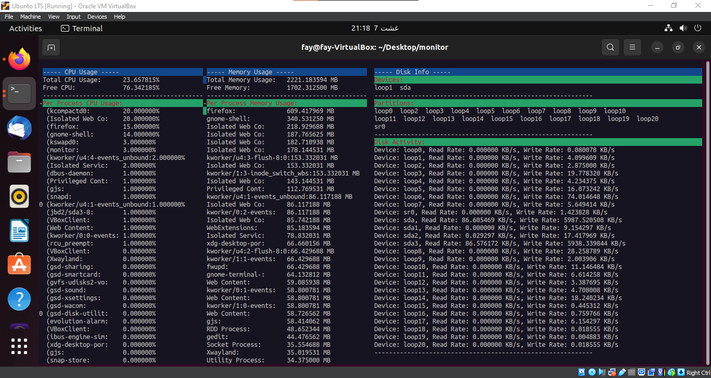
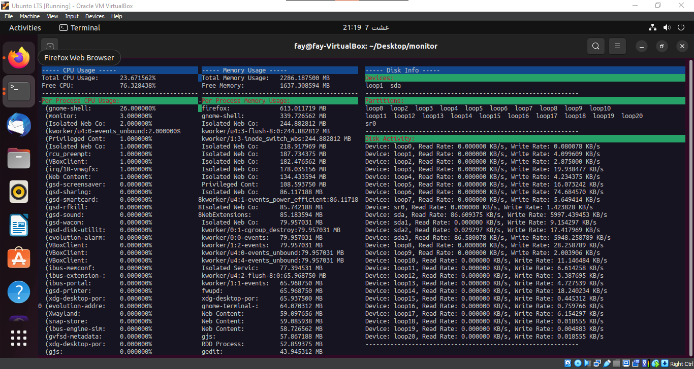

# Monitor Application

The Monitor Application is a command-line utility that monitors CPU, memory, and disk usage on your system. It provides a user-friendly interface with visual tables displaying real-time usage statistics.

## Application overview

- [X] Builds on Linux
- [X] Monitor CPU
	- [X] Current total usage
	- [X] Current usage per application
	- [X] Current free
- [X] Monitor Memory
	- [X] Current total usage
	- [X] Current total free
	- [X] Current usage per application
- [X] Monitor Disk
	- [X] Available devices
	- [X] Available partitions
	- [X] Read rate per application
	- [X] Write rate per application
- [X] Real-time stats collection 2-seconds refresh
- [X] Terminal-based UI

## File Structure
```
.
├── include
│   ├── cpu_monitor.h
│   ├── disk_monitor.h
│   └── memory_monitor.h
├── src
│   ├── cpu_monitor.cpp
│   ├── disk_monitor.cpp
│   └── memory_monitor.cpp
├── main.cpp
├── README.md
├── screenshots
└── monitor (Executable)
```

- include: Contains header files for the CPU, memory, and disk monitors. 
- src: Contains source files for the CPU, memory, and disk monitors.
- monitor: The compiled executable of the Monitor Application.

## Dependencies

- C++11
- ncurses library

## How to Build

To build the Monitor Application, ensure you have `g++` and the `ncurses` library installed on your system. Then, use the following command to compile the project:

```bash
sudo g++ -o monitor main.cpp src/cpu_monitor.cpp src/memory_monitor.cpp src/disk_monitor.cpp -lncurses -Iinclude
```
## How to Run

After building the application, you can run it with the following command:
```bash
./monitor
```

The application will display three separate sections for CPU, memory, and disk monitor data in visual tables. The data will be updated every **2 seconds**.To quit the application, you can use one of the following methods:

    Press q or Q while the application is running.
    Use Ctrl+C in the terminal to terminate the application.

## Viewing Tips

To ensure that all the statistics are fully visible within your terminal window, you may need to zoom out your terminal's size. The application's UI is designed to present data in an ordered manner, with the most used tasks listed first. By adjusting the terminal's zoom level, you can have a comprehensive view of the real-time usage statistics for CPU, memory, and disk.

You can zoom out using keyboard shortcuts such as `Ctrl` + `-` (minus sign) or your terminal emulator's zoom functionality. This will help you see the complete tables.


Keep in mind that the data is presented in an organized manner, from the most used to the least used tasks, making it easier to prioritize and assess system resource usage at a glance.

## Screenshots




## License
[MIT License](LICENSE)
